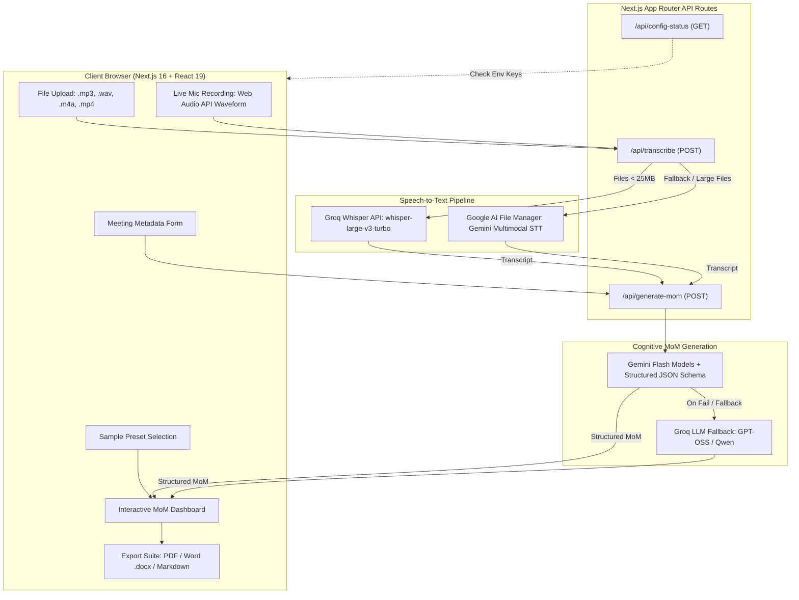

# MoMento AI — Intelligent Minutes of Meeting (MoM) Generator

<div align="center">


<p align="center">
  <strong>Transform raw meeting recordings and live conversations into executive-grade, structured, and exportable Minutes of Meeting in seconds.</strong>
</p>

[Key Features](#-key-features) •
[Architecture](#-system-architecture) •
[Tech Stack](#-technology-stack) •
[Quick Start](#-quick-start) •
[Configuration](#-configuration--api-keys) •
[API Reference](#-api-endpoints) •
[Export Capabilities](#-executive-export-suite) •
[Privacy & Security](#-privacy--zero-data-persistence)

</div>

---

## 📖 Overview

**MoMento AI** is a minimalist, executive-grade web application engineered with **Next.js 16 (App Router), React 19, Tailwind CSS v4, and Dual AI Pipelines (Google Gemini & Groq Whisper)**. 

Whether uploading recorded meetings or speaking directly into the browser, MoMento AI transcribes speech with verbatim fidelity, applies cognitive intelligence to extract key decisions and deliverables, and packages everything into an interactive dashboard ready for one-click **PDF**, **Microsoft Word (.docx)**, or **Markdown** export.

---

## 🌟 Key Features

### 🎙️ Dual Audio Ingestion & Instant Presets
* **Audio / Video Upload:** Drag-and-drop or select any common media file (`.mp3`, `.wav`, `.m4a`, `.webm`, `.aac`, `.mp4`).
* **Live In-Browser Recording:** Capture live meetings via `MediaRecorder` and the Web Audio API with a real-time dynamic audio waveform canvas, volume meter, and pause/resume controls.
* **1-Click Test Presets:** Built-in real-world meeting scenarios (Engineering Sprint Planning, Executive Board Strategy, Client Onboarding) with pre-recorded transcripts and structured outputs for instant evaluation without requiring audio uploads or API keys.

### 🧠 Dual-Engine Speech & Cognitive Pipeline
* **High-Fidelity Speech-to-Text (STT):**
  * **Groq Whisper (`whisper-large-v3-turbo` / `whisper-large-v3`):** Ultra-fast sub-second audio transcription for files under 25 MB.
  * **Google Gemini File API (`GoogleAIFileManager`):** High-capacity multimodal audio engine supporting large meeting recordings (up to 2 GB) with automated cloud file cleanup.
  * **Gemini Inline Audio STT:** Fast in-memory processing for short audio snippets (< 3 MB).
* **Cognitive Extraction & Schema Enforcement:**
  * Uses structured JSON schema decoding to reliably generate:
    * **Executive Summary:** Crisp, 3–5 sentence context and outcomes synthesis.
    * **Categorized Discussion Topics:** Thematic headers paired with detailed discussion points.
    * **Decisive Agreements:** Formalized resolutions, approvals, and policies isolated from casual debate.
    * **Action Matrix:** Concrete tasks mapped to specific assignees, deadlines, and interactive status flags (`pending`, `in_progress`, `completed`).
    * **Unresolved Items & Blockers:** Open risks, pending approvals, and external dependencies.
* **Automatic LLM Fallback Cascade:**
  * Primary: Google Gemini model family (`gemini-3.6-flash`, `gemini-3.5-flash`, `gemini-flash-latest`, `gemini-3.1-flash-lite`, `gemini-3.7-flash`, `gemini-2.5-flash`).
  * Secondary Fallback: Groq LLMs (`openai/gpt-oss-120b`, `openai/gpt-oss-20b`, `qwen/qwen3.6-27b`).

### ✍️ Interactive In-Place Editor & Inspector
* **Live Dashboard Editing:** Click to edit meeting title, summary, discussion cards, decisions, and blockers inline.
* **Interactive Task Tracking:** Toggle task statuses with one click or add/remove action items on the fly.
* **Verbatim Transcript Inspector:** Search spoken words in real time with keyword highlighting and match counters.
* **Raw JSON Inspector:** Inspect or copy the clean JSON output directly.

### 📄 Executive Export Suite
* **Board-Ready PDF (`jspdf` + `jspdf-autotable`):** Formatted executive layout with stylized headers, metadata boxes, styled discussion panels, and structured tables.
* **Microsoft Word (.docx) (`docx` + `file-saver`):** Native `.docx` document with matching typography, headers, callouts, and formatted action item tables.
* **Markdown / Email Copy:** One-click clipboard copy formatted for Notion, Slack, Jira, GitHub, or Email.

---

## 🏗️ System Architecture



---

## 🛠️ Technology Stack

| Layer | Technologies |
|---|---|
| **Framework** | [Next.js 16](https://nextjs.org/) (App Router, Server Actions, Dynamic API Routes) |
| **Frontend UI** | [React 19](https://react.dev/), [TypeScript 5](https://www.typescriptlang.org/) |
| **Styling** | [Tailwind CSS v4](https://tailwindcss.com/) with PostCSS |
| **Icons** | [Lucide React](https://lucide.dev/) |
| **AI SDKs** | [`@google/generative-ai`](https://www.npmjs.com/package/@google/generative-ai), [`groq-sdk`](https://www.npmjs.com/package/groq-sdk) |
| **Document Generation** | [`jspdf`](https://www.npmjs.com/package/jspdf), [`jspdf-autotable`](https://www.npmjs.com/package/jspdf-autotable), [`docx`](https://www.npmjs.com/package/docx), [`file-saver`](https://www.npmjs.com/package/file-saver) |
| **Audio Processing** | Web Audio API, `MediaRecorder`, Node `fs` Streams |
| **UI Effects** | [`canvas-confetti`](https://www.npmjs.com/package/canvas-confetti) |

---

## 📁 Project Structure

```
Ai MOM generator/
├── public/                     # Static assets (favicons, icons)
├── src/
│   ├── app/
│   │   ├── api/
│   │   │   ├── config-status/  # GET: Check if server has API keys configured
│   │   │   │   └── route.ts
│   │   │   ├── generate-mom/   # POST: AI cognitive extraction into structured MoM
│   │   │   │   └── route.ts
│   │   │   └── transcribe/     # POST: Dual-pipeline STT (Groq / Gemini)
│   │   │       └── route.ts
│   │   ├── globals.css         # Tailwind v4 theme styling
│   │   ├── layout.tsx          # Root layout & metadata
│   │   └── page.tsx            # Primary application orchestrator
│   ├── components/
│   │   ├── ApiKeyModal.tsx     # Client-side API key configuration modal
│   │   ├── AudioUploader.tsx   # Drag-and-drop audio file upload UI
│   │   ├── ExportActions.tsx   # PDF, Word, Markdown download controls
│   │   ├── Header.tsx          # Sticky navigation bar & status indicators
│   │   ├── LiveRecorder.tsx    # Live audio microphone capture & visual waveform
│   │   ├── MeetingSetupForm.tsx# Meeting metadata configuration
│   │   ├── ModeSelector.tsx    # Mode toggles (Upload, Live, Presets)
│   │   ├── MoMDashboard.tsx    # Interactive Minutes of Meeting dashboard
│   │   ├── MomentoLogo.tsx     # Vector brand mark component
│   │   ├── PresetSelectorModal.tsx # 1-click sample preset selector
│   │   ├── ProcessingState.tsx # Multi-step progress animation
│   │   └── Toast.tsx           # Floating feedback notification
│   ├── data/
│   │   └── presets.ts          # Sample meeting scenarios & test suites
│   ├── types/
│   │   └── mom.ts              # Core TypeScript interfaces (MoMData, Metadata, etc.)
│   └── utils/
│       ├── docxExport.ts       # Microsoft Word .docx generator
│       ├── downloadHelper.ts   # Browser blob download utility
│       ├── markdownExport.ts   # Formatted Markdown compiler
│       └── pdfExport.ts        # Executive PDF layout engine
├── .env.local.example          # Environment variables template
├── package.json                # Project dependencies and run scripts
├── tsconfig.json               # TypeScript compiler configuration
└── README.md                   # Project documentation
```

---

## 🚀 Quick Start

### Prerequisites
* [Node.js](https://nodejs.org/) v18.18+ or v20+ (Node 20+ recommended)
* `npm`, `yarn`, or `pnpm`

### 1. Clone the Repository
```bash
git clone https://github.com/your-username/ai-mom-generator.git
cd ai-mom-generator
```

### 2. Install Dependencies
```bash
npm install
```

### 3. Configure Environment Variables
Copy the sample environment file:
```bash
cp .env.local.example .env.local
```

Edit `.env.local` with your API keys (optional if configuring keys through the web UI):
```env
# Google Gemini API Key (Required for AI MoM analysis & Native Audio STT)
# Free key at: https://aistudio.google.com/app/apikey
GEMINI_API_KEY=your_gemini_api_key_here

# Groq API Key (Optional: enables ultra-fast Whisper-large-v3 STT)
# Free key at: https://console.groq.com/keys
GROQ_API_KEY=your_groq_api_key_here
```

### 4. Run the Development Server
```bash
npm run dev
```

Open [http://localhost:3000](http://localhost:3000) in your browser.

---

## 🔑 Configuration & API Keys

MoMento AI supports two flexible key management methods:

### Option A: Server Environment (`.env.local`)
Set your keys in `.env.local` for shared or team deployments. The server automatically uses these credentials.

### Option B: In-Browser Client Settings (Zero Setup)
Click **Configure Key** in the top navigation bar. Users can enter their personal Gemini or Groq API key:
* Stored exclusively in browser `localStorage`.
* Forwarded via secure request headers (`x-gemini-key`, `x-groq-key`).
* Never saved to server files or persistent storage.

---

## 📡 API Endpoints

### `POST /api/transcribe`
Transcribes audio recordings into clean text.
* **Content-Type:** `multipart/form-data` (with file field) or `application/json` (with `audioBase64`).
* **Headers:** `x-gemini-key` *(optional)*, `x-groq-key` *(optional)*.
* **Response:**
  ```json
  {
    "transcript": "Verbatim meeting dialogue...",
    "wordCount": 420,
    "provider": "groq-whisper"
  }
  ```

### `POST /api/generate-mom`
Processes transcript text and extracts structured Minutes of Meeting.
* **Request Body:**
  ```json
  {
    "transcript": "Raw meeting transcript...",
    "metadata": {
      "title": "Sprint 34 Planning",
      "date": "2026-10-07",
      "startTime": "10:00",
      "endTime": "11:00",
      "venue": "Zoom Conf 2",
      "attendees": ["Alex Chen", "Sarah Miller"]
    }
  }
  ```
* **Response:** Returns complete `MoMData` JSON structure.

### `GET /api/config-status`
Returns whether Gemini or Groq API keys are present in server environment variables.

---

## 📄 Executive Export Suite

| Format | Library | Features |
|---|---|---|
| **PDF Document** | `jspdf` + `jspdf-autotable` | Professional typography, colored section accents, organized action items matrix, metadata banner, page numbering. |
| **Word (.docx)** | `docx` + `file-saver` | Corporate styling, callout blocks, table borders, compatible with Microsoft Word & Google Docs. |
| **Markdown** | Custom compiler | GitHub / Notion flavored Markdown ready for Slack, Jira, or email distribution. |
| **Raw JSON** | Native | Complete machine-readable JSON schema for integration into external CRMs or workflow tools. |

---

## 🔒 Privacy & Zero Data Persistence

1. **No Database Storage:** No audio streams, transcripts, or meeting minutes are persisted in any database or cloud bucket.
2. **Ephemeral Audio Streams:** Uploaded audio buffers are streamed in-memory or saved to transient temp directories and purged immediately after processing.
3. **Automated Cloud Cleanup:** Temporary files uploaded via Google AI File Manager are deleted via `finally` execution blocks immediately following transcription.
4. **Instant Purge & Reset:** Clicking **Purge & Reset** instantly resets all React state and wipes client memory.

---

## 📜 Available Scripts

| Command | Description |
|---|---|
| `npm run dev` | Runs the Next.js development server with Turbopack on `0.0.0.0:3000` |
| `npm run build` | Builds the optimized production application |
| `npm run start` | Starts the production server |
| `npm run lint` | Runs ESLint validation across all TypeScript and React files |

---

## 📄 License

This project is open-source and released under the **[MIT License](LICENSE)**.
